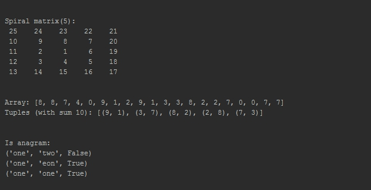

# Summary
My implementation of a several programming tasks from interview.

All examples: [main.py](main.py)

# Matrices
## Spiral/snail matrix
Example of how to create matrix like this: <br>
9 8 7 <br>
2 1 6 <br>
3 4 5 
```python
# size = 5
# answer:
# 25    24    23    22    21  
# 10     9     8     7    20  
# 11     2     1     6    19  
# 12     3     4     5    18  
# 13    14    15    16    17 
def create_snail_matrix(size):
```
<br>Source: [matrix_problems.py](data_structure/problem/matrix/matrix_problems.py)

# Arrays

## Google problem with bars:
How many water given bars will collect?
```python
# array = [1, 2, 0, 1, 3, 1]
# answer: 3
#
#|  |  |  |  |oo|  |
#|  |oo|~~|~~|oo|  |
#|oo|oo|~~|oo|oo|oo|
#  0  1  2  3  4  5 

def find_water_count(array):
```
<br>Source: [array_problems.py](data_structure/problem/array/array_problems.py)

## Pairs
Find a pair of elements from an array whose sum equals a given number:
```python
# array = [8, 0, 6, 6, 9, 4, 1, 4, 9, 3, 9, 1, 0, 4, 2, 6, 5, 7, 5, 6]
# value = 10
# answer: [(4, 6), (9, 1), (5, 5), (6, 4)]
def find_pairs(array, value):
```
<br>Source: [array_problems.py](data_structure/problem/array/array_problems.py)

## Left rotation
Example of a left rotation operation on an array: 
```python
# a = [1, 2, 3, 4, 5]
# k = 2
# answer: [3, 4, 5, 1, 2]
def array_left_rotation(a, k):
```
<br>Source: [array_problems.py](data_structure/problem/array/array_problems.py)

## Sub array with max sum
How to find sub array with max sum: 
```python
# given array = [1, 2, -2, -3, 0, 0, 9, -1, 5, 2]
# answer: [9, -1, 5, 2]
def max_sum_sub_array(given_array):
```
<br>Source: [array_problems.py](data_structure/problem/array/array_problems.py)

# Sequences
## Print numbers can be divided by 3 and can not be divided by 5...
Example how to find numbers can be divided by 3 and can not be divided by 5.
Sum of all digits in each number is less than 10.
```python
# n=40
# answer: [3, 6, 9, 12, 18, 21, 24, 27, 33, 36]
def create_3_5_10_array(n):
```
<br>Source: [sequence_problems.py](data_structure/problem/sequence/sequence_problems.py)

## Find primes
Example how to find prime numbers with the sieve of eratosthenes:
```python
# n=50
# sort=True
# answer: [1, 2, 3, 5, 7, 11, 13, 17, 19, 23, 29, 31, 37, 41, 43, 47]
def sieve_of_eratosthenes(n, sort=False):
```
<br>Source: [sequence_problems.py](data_structure/problem/sequence/sequence_problems.py)


# Trees
## Binary search tree
Check is this a binary search tree:
```python
# root = 8(4(2(1(None, None), 3(None, None)), 6(None, None)), 13(10(None, None), 14(None, None)))
# answer: True
def check_binary_search_tree(root):
```
<br>Source: [tree_problems.py](data_structure/problem/tree/tree_problems.py)

## Lowest common ancestor
Example of finding a lowest common ancestor:
```python
# root = 8(4(2(1(None, None), 3(None, None)), 6(None, None)), 13(10(None, None), 14(None, None)))
# a: 6
# b: 1
# answer: 4
def get_lowest_common_ancestor(root, a, b):
```
<br>Source: [tree_problems.py](data_structure/problem/tree/tree_problems.py)


# Strings
## Anagram
Check for anagrams (case sensitive)
```python
# s1 = one
# s2 = eon
# answer: True
def check(s1, s2):
```
<br>Source: [string_problems.py](data_structure/problem/string/string_problems.py)

## Find first not recurring character
```python
# s = ABACDBCEAB
# answer: D
def find_first_not_recurring_character(s):
```
<br>Source: [string_problems.py](data_structure/problem/string/string_problems.py)
## Screenshot

